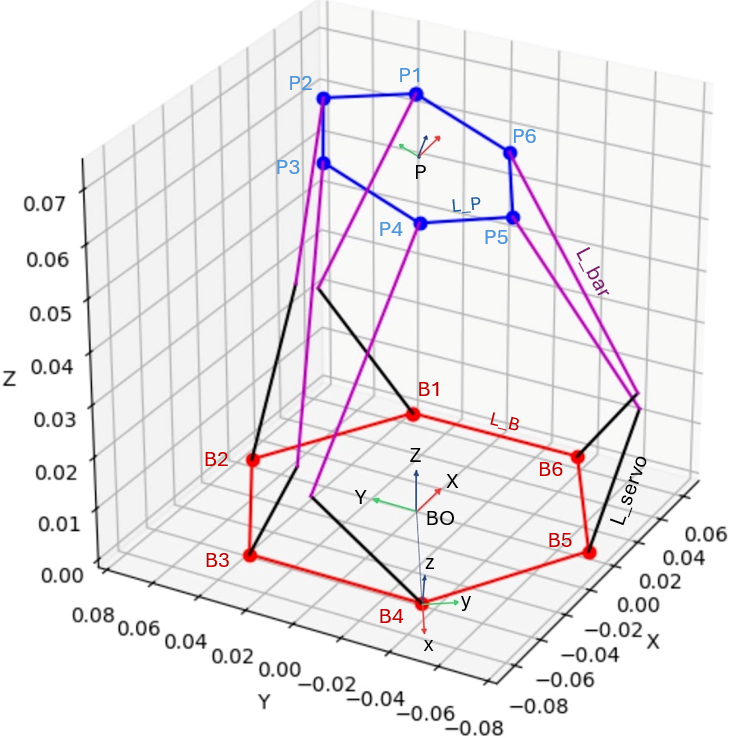

# stewart-platform-inverse-kinematics

A simple inverse kinematics solver for a Stewart Platform with an additional correction step for servo motors.

## Platform Diagram

Refer to the image below for the dimensions, parameters, frames, and axes used to calculate the servo angles.

