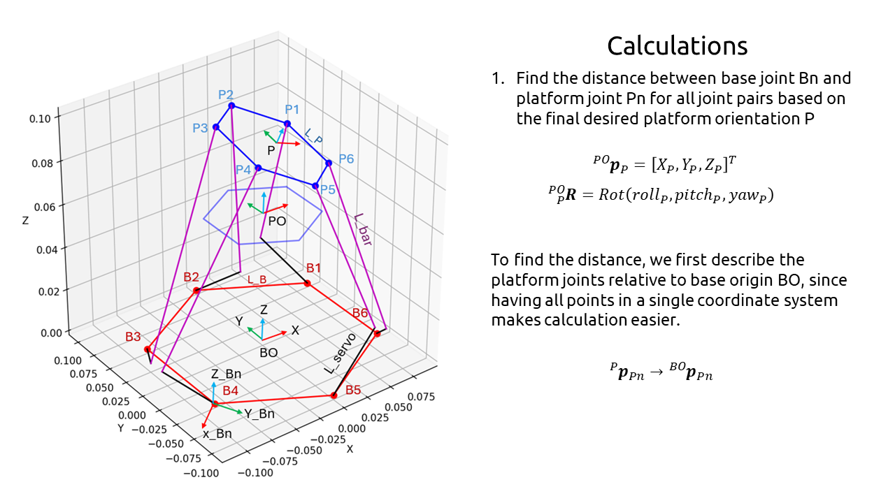
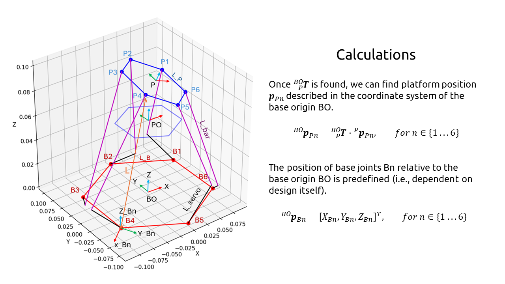
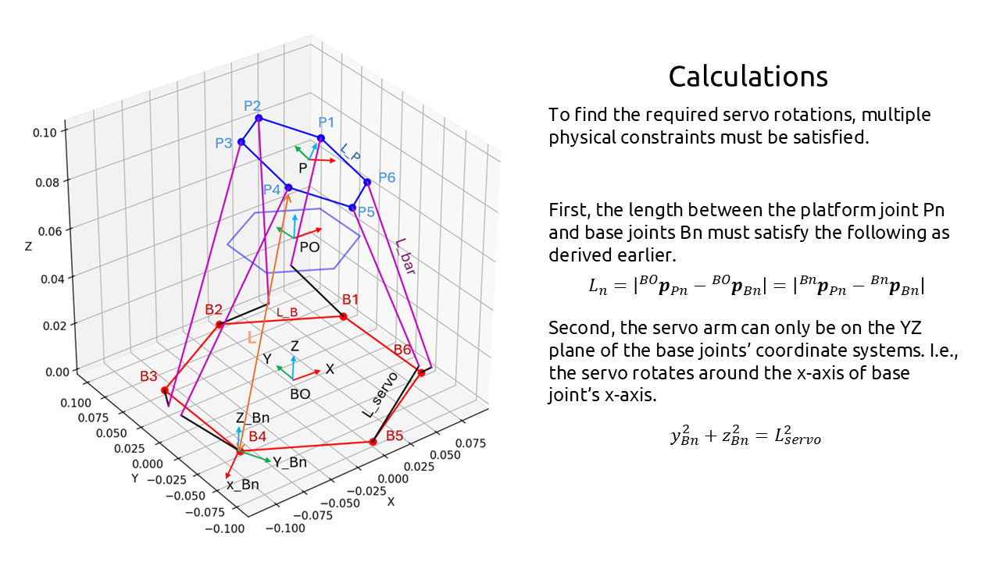
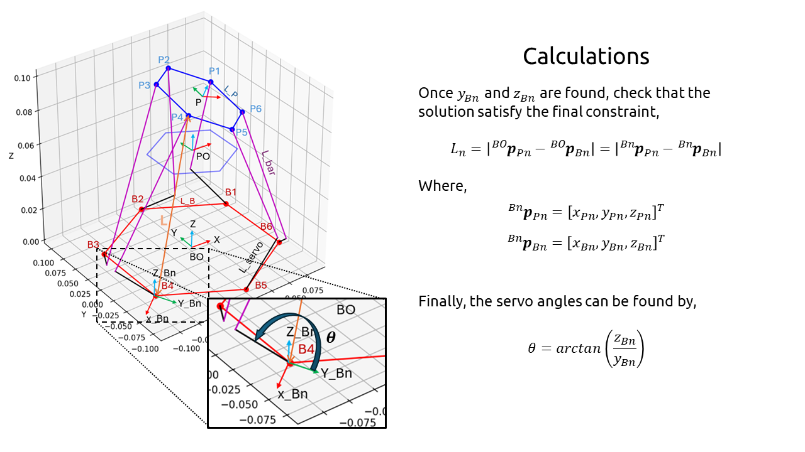

# Stewart Platform Inverse Kinematics Solver

A simple inverse kinematics solver for a Stewart Platform with an additional correction step for servo motors. Note: this can also be used with Stewart Platforms with linear actuators.

## Features

- **Inverse Kinematics Solver**: Given the position and orientation of the platform, the script calculates the lengths of linear actuators and servo angles needed to achieve that position.
- **Plotting**: The script can generate 3D plots of the Stewart platform showing the base joints, platform joints, and servo arms.
- **Customizable Parameters**: The parameters of the Stewart platform, such as lengths of bars, servos, and joint positions, are customizable.

## Usage

1. Import the class from the script.
2. Instantiate the `StewartPlatformKinematics` class.
3. Call the `inverse_kinematics()` method to calculate lengths and angles based on the desired platform position.
4. Optional: Adjust parameters such as dimensions and default orientation of the platform.
5. Optional: Call the `plot_stewart_platform()` method to visualize the platform.

```python
# Example usage 
s = StewartPlatformKinematics()

# Visualise the platform
s.plot_stewart_platform(P_P_PO=np.array([0.01, 0, -0.03]), ROT_P_PO=np.array([10,10,10]), is_deg=True)

# Find the lengths for the linear actuators, and/or the servo angles to
# move the platform to x=0.01, y=0.0, z=-0.03, roll=10deg, pitch=10deg, yaw=10deg
# relative to the platform's default origin (can be customised in the code)
L, theta, _, _ = s.inverse_kinematics(np.array([0.01, 0, -0.03]), np.array([10,10,10]), is_deg=True)
```

## Requirement

1. **Numpy** ```pip install numpy```
2. **Matplotlib** ```pip install matplotlib```

## Platform Diagram

Refer to the image below for the dimensions, parameters, frames, and axes used to calculate the servo angles.


## Inverse Kinematics Calculation











